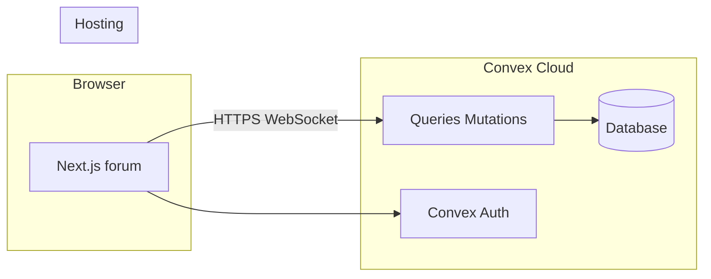

# Architecture, software stack, and tool versions

This document describes how the repo is structured, which major technologies are in use, and **pinned or declared versions** as recorded in `package.json` files. After upgrades, refresh the tables from those files (and lockfile) so agents stay accurate.

## System context

- **Forum UI:** Next.js app in `apps/forum`, deployed (e.g. Vercel) with env `NEXT_PUBLIC_CONVEX_URL`.
- **Backend:** Convex project (schema, functions, auth) in `convex/`.
- **Other apps:** `apps/seller`, `apps/admin`, `apps/marketplace` are placeholders; same workspace tooling, lighter dependencies.

## Monorepo and runtime

| Item | Version / note | Source |
|------|----------------|--------|
| **Node.js** | **20** (see repo [`.nvmrc`](../.nvmrc)) | `.nvmrc` |
| **pnpm** | **10.28.2** | [`package.json`](../package.json) `packageManager` |
| **Workspace layout** | `apps/*`, `packages/*` | [`pnpm-workspace.yaml`](../pnpm-workspace.yaml) |
| **TypeScript** | **5.9.3** | [`apps/forum/package.json`](../apps/forum/package.json) |

## Forum app (`apps/forum`) — main dependencies

| Software | Version (range) | Role |
|----------|-----------------|------|
| **Next.js** | **16.1.6** | App Router, `next dev --webpack` / `next build --webpack` |
| **React** | **19.2.4** | UI |
| **React DOM** | **19.2.4** | UI |
| **convex** | **^1.34.0** | Client SDK, `useQuery` / `useMutation` |
| **@convex-dev/auth** | **^0.0.91** | Auth integration with Convex |
| **Tailwind CSS** | **^4.2.2** | Styling |
| **@tailwindcss/postcss** | **^4.2.2** | PostCSS pipeline |
| **PostCSS** | **^8** | CSS tooling |
| **motion** | **^12.34.3** | Animation |
| **next-themes** | **^0.4.6** | Theme switching |
| **lucide-react** | **^0.575.0** | Icons |
| **clsx** | **^2.1.1** | Class names |
| **tailwind-merge** | **^3.5.0** | Merge Tailwind classes |
| **class-variance-authority** | **^0.7.1** | Component variants |

### Radix UI (forum)

| Package | Version |
|---------|---------|
| @radix-ui/react-avatar | ^1.1.11 |
| @radix-ui/react-dialog | ^1.1.15 |
| @radix-ui/react-dropdown-menu | ^2.1.16 |
| @radix-ui/react-tabs | ^1.1.13 |
| @radix-ui/react-tooltip | ^1.2.8 |

### TipTap (forum — e.g. `/new-post`)

| Package | Version |
|---------|---------|
| @tiptap/react | ^3.22.1 |
| @tiptap/starter-kit | ^3.22.1 |
| @tiptap/extension-link | ^3.22.1 |
| @tiptap/extension-placeholder | ^3.22.1 |
| @tiptap/extension-underline | ^3.22.1 |

### Forum devDependencies

| Software | Version |
|----------|---------|
| **ESLint** | **9.39.2** |
| **eslint-config-next** | **16.1.6** |
| **@types/node** | **^20** |
| **@types/react** | **^19** |
| **@types/react-dom** | **^19** |

## Workspace packages

| Package | Path | Notes |
|---------|------|--------|
| **@cemvp/auth-ui** | [`packages/auth-ui`](../packages/auth-ui) | Peer deps align with forum: React 19, Convex, Radix dialog, etc. |
| **@cemvp/convex-client** | [`packages/convex-client`](../packages/convex-client) | Small helper for Convex URL / client config |

## Repository root (Convex + auth shared with backend)

| Software | Version | Role |
|----------|---------|------|
| **convex** (CLI / server types in dev) | **^1.34.1** | `pnpm convex:dev`, codegen, deploy |
| **@convex-dev/auth** | **^0.0.91** | Server-side auth (also in forum) |
| **@auth/core** | **0.37.0** | Auth.js–compatible core (OAuth/password providers) |
| **jose** | **^6.2.2** | JWT utilities (e.g. key generation script) |

## Backend layout (conceptual)

| Area | Location |
|------|----------|
| Schema | [`convex/schema.ts`](../convex/schema.ts) |
| Forum API | [`convex/forum/`](../convex/forum/) |
| Auth config | [`convex/auth.ts`](../convex/auth.ts), [`convex/auth.config.ts`](../convex/auth.config.ts) |

## Deployment and external services (intent)

| Service | Use |
|---------|-----|
| **Convex** | Database, server functions, scheduled work, Convex Auth HTTP routes |
| **Vercel** (typical) | Next.js hosting per app root (`apps/forum`, etc.) |
| **OAuth providers** | GitHub, Google, Facebook — configured via Convex env (see [README.md](../README.md)) |

Exact platform versions (Node on Vercel, Convex runtime) are controlled by those providers; not pinned in this repo.

## How to refresh versions for agents

1. Read `package.json` in the root, `apps/forum`, and `packages/*`.
2. Optionally run `pnpm list --depth 0` for resolved versions in a given workspace.
3. Update this file when bumping major frameworks (Next, React, Convex, Tailwind).

## Related docs

- [overview.md](overview.md) — product / monorepo overview  
- [quick-start.md](quick-start.md) — run locally  
- [schema-forum.md](schema-forum.md) — Convex tables  
- [README.md](README.md) — env vars and OAuth  
